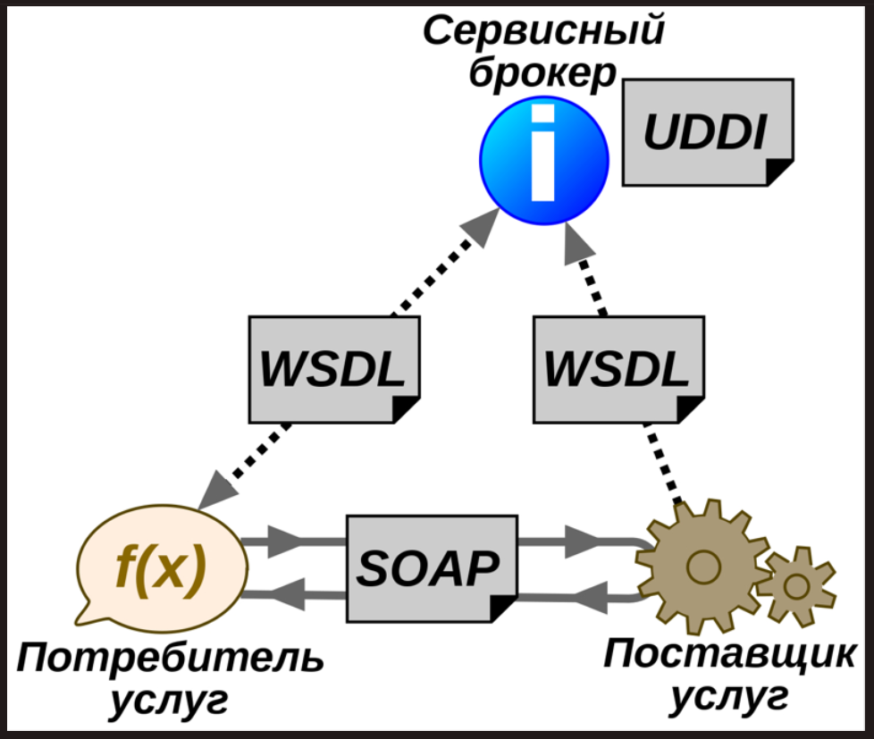

# Определение

Веб-служба, веб-сервис (англ. web service) — идентифицируемая уникальным веб-адресом (URL-адресом) программная система со стандартизированными интерфейсами.

Веб-службы могут взаимодействовать друг с другом и со сторонними приложениями посредством сообщений, основанных на определённых протоколах (SOAP, XML-RPC и т. д.) и соглашениях (REST).

В обиходе веб-сервисами называют услуги, оказываемые в Интернете.

Различные приложения на различных узлах сети функционируют на разных аппаратно-программных платформах, и используют различные технологии и языки. Чтобы связать все это и предоставить возможность одним приложениям обмениваться данными с другими, и были придуманы веб-сервисы. По сути, веб-сервисы - это реализация абсолютно четких интерфейсов обмена данными между различными приложениями, которые написаны не только на разных языках, но и распределены на разных узлах сети.

# Преимущества

- Веб-службы обеспечивают взаимодействие программных систем независимо от платформы. Например, Windows-C#-клиент может обмениваться данными с Java-сервером, работающим под Linux.
- Веб-службы основаны на базе открытых стандартов и протоколов. Благодаря использованию XML достигается простота разработки и отладки веб-служб.
- Использование интернет-протокола обеспечивает HTTP-взаимодействие программных систем через межсетевой экран. Это значительное преимущество, по сравнению с такими технологиями, как [CORBA](./CORBA.md), [DCOM](./DCOM.md) или [Java RMI](./Java%20RMI.md). С другой стороны, веб-службы не привязаны намертво к HTTP — могут использоваться и другие протоколы.

# Недостатки

- Меньшая производительность и больший размер сетевого трафика по сравнению с технологиями RMI, CORBA, DCOM за счёт использования текстовых XML-сообщений. Однако на некоторых веб-серверах возможна настройка сжатия сетевого трафика.
- Аспекты безопасности. Ответственные веб-службы должны использовать кодирование, возможно — требовать аутентификации пользователя. Достаточно ли здесь применения HTTPS, или предпочтительны такие решения, как XML Signature, XML Encryption или SAML — должно быть решено разработчиком.

# Архитектура

Как показано на рисунке, можно выделить три инстанции, взаимодействующие в рамках веб-службы. Переведем их названия как:

- заказчик (service requester);
- исполнитель (service provider);
- каталог (service broker).

Когда служба разработана, исполнитель регистрирует ее в каталоге, где её могут найти потенциальные заказчики. Заказчик, найдя в каталоге подходящую службу, импортирует оттуда её WSDL-спецификацию и разрабатывает в соответствии с ней своё программное обеспечение. WSDL описывает формат запросов и ответов, которыми обмениваются заказчик и исполнитель в процессе работы.

Для обеспечения взаимодействия используются следующие [стандарты/протоколы](./Web%20Service%20Protocols.md)

# Отличие сервиса от сервера

Сервис (микросервис) - это программа, размещаемая на сервере, которая предоставляет определенную функцию, находясь по определенному адресу и используя четко определенные интерфейсы и логику. Сегодня это чаще всего интерфейсы API.

Сервер может хостить в себе тысячи сервисов. Впрочем, и один сервис может быть размещен на нескольких серверах. В более широком плане - сервер - это виртуальная машина, которая хостит в себе Apache, IIS и много-много web-сервисов. Еще в более широком плане - это железяка, которая хостит в себе множество виртуалок.
